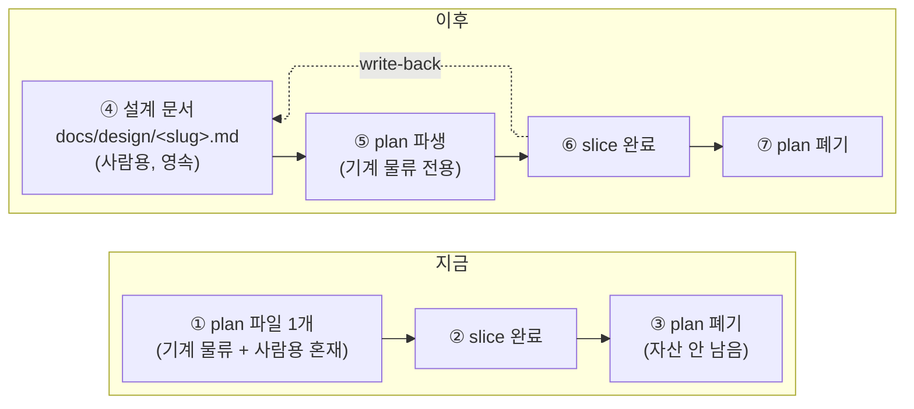

# 설계 문서 템플릿 도입 (plan-presentation)

포함: 원인분석 ✓ / 구조델타 ✓ / 결정갈림길 ✓ / 기준선=관측증거

## 1. 요구 또는 증상

plan-dev 의 산출물(plan 파일)은 사람이 안 읽고 작업 후 자산이 안 남는다. slice 완료 후 plan 은 폐기되고, repo 에 남는 건 커밋 메시지 한 줄뿐 — 나중에 "이 기능을 왜 이렇게 만들었는지" 되짚을 문서가 없다.

## 2. 원인 분석

plan 파일 한 개가 **두 독자**(dispatch 스크립트 같은 기계, plan 을 검토하는 사람)를 동시에 섬기면서, 순서가 기계 우선으로 짜여 있다. `commands/plan-dev.md:50` 기준 필수 섹션 8개 중 사람이 읽고 싶어할 "왜 이렇게 했는가" 성격의 섹션이 6번째 — 앞의 5개(Slice File Map, dispatch 인자 등)를 다 넘겨야 나온다. 그 결과 plan 은 기계 물류 문서로 최적화되고, 완료 후 폐기돼도 아무도 아쉬워하지 않는 소모품이 됐다.

## 3. 구조 델타 (지금 → 이후)

지금은 plan 하나가 기계 물류와 사람용 서술을 같이 지고 폐기된다. 이후는 설계 문서(④)가 영속 원본이 되고, plan(⑤)은 거기서 파생된 기계 전용 산출물로 격하돼 여전히 폐기 가능하다. 완료 후 실측은 ⑦→④ write-back 으로 설계 문서에 남는다.

## 4. 결정 갈림길

| 선택 | 버린 대안 | 이유 | 뒤집는 비용 |
|---|---|---|---|
| 경로 `docs/design/` | `.claude/design/`, 외부 vault | `.gitignore` 가 `.claude/specs/*.spec.md` 를 이미 제외 — `.claude/` 는 영속 문서 자리가 아니라는 물증. repo 최상위 `docs/`가 사람이 찾아볼 위치 | 낮음 — 디렉토리 이동 + grep 경로 수정 몇 줄 |
| 하네스 위치: Phase 5 push 게이트 (`finish-plan-dev.sh`) | commit 시점 hook | 설계 문서는 기능당 1개 = **세션당 1개**라 commit(세션당 N회)과 granularity 가 안 맞아 커밋마다 env prefix = 마찰. 실측값은 작업이 끝난 push 시점에만 존재한다 | 중간 — 검사 로직을 hook 으로 이동 + 우회 env 3개 재배선 |
| 착수 전 승인은 콘텐츠 전용 강제 | `PreToolUse:ExitPlanMode` 게이트 | `PostToolUse:ExitPlanMode` 가 이 빌드에서 미발화해 승인 시점을 hook 으로 잡을 수 없음. 하네스는 push 백스톱뿐 — 승인 없이 진행한 세션은 push 에서만 걸린다 | 높음 — 상류 hook 발화가 고쳐져야 뒤집을 수 있음 |
| 템플릿 분기: 단일 템플릿 + 조건부 블록 | `feat`/`fix` 별 템플릿 2종 | commit type 은 실제 내용과 안 맞음(fix 도 구조 델타 필요, feat 도 원인분석 필요) — type 기반 분기는 처음부터 잘못된 축 | 높음 — 이미 나뉜 템플릿을 나중에 합치려면 기존 문서 전부 재작성 필요 |

## 5. 착수 전 기준선 (관측 증거)

- `commands/plan-dev.md:50` — 필수 섹션 8개 중 사람용 섹션이 6번째(기계 물류 5개가 앞에 옴)
- `.gitignore:34` — `.claude/specs/*.spec.md` 존재. `.claude/` 에 영속 문서를 두면 안 된다는 물증(spec 파일도 결국 이 규칙 아래 제외 대상)

두 증거 다 "지금 구조가 사람용 자산을 남기지 않는다"는 것을 재현 절차 없이도 뒷받침한다.

## 6. 결과

| 항목 | 목표 | 실측 |
|---|---|---|
| 설계 문서 템플릿 신설 | `commands/plan-dev/design-doc.md` 존재 + lint 통과 | `tests/design_doc_template_lint.sh` 11항목 OK |
| 첫 사례 적용 | 이 문서 자체가 필수 헤딩 전부 포함 | lint step 11 OK (`포함:`/기준선/결정 갈림길/목표/실측) |
| 설계 승인 게이트 (Phase 1-1.5) | plan-dev.md 에 단계 신설 + 게이트 파생 규칙 | `tests/plan-dev_design_gate_lint.sh` 9항목 OK |
| 실측 write-back 강제 (Phase 5) | latch + 실측 미기입 시 push 차단, 선택지 제시 | `tests/plan_dev_design_latch.sh` T1~T13 OK |
| 코어 200줄 캡 유지 | `commands/plan-dev.md` ≤ 200 | 200줄 (상세는 `plan-dev/design-doc.md` 로 이관) |
| 기존 테스트 무회귀 | 전 스위트 계속 통과 | 86개 실행, 실패 0 (게이트 도입으로 `finish` 계열 5개 스위트에 `DISABLE_DESIGN_DOC_GATE=1` 선언 추가 — 계약 변경 반영) |
| mermaid elk 실렌더 여백 개선 | Obsidian 에서 `rankSpacing: 90` + elk 정렬 육안 확인 | **미검증 — 재발 감시 중** (번들에 `mermaid@11.4.1` + `registerLayoutLoaders`/`elk` 존재는 확인, 실제 렌더 육안 확인은 사용자 몫. GitHub 은 elk 미등록 가능 → 템플릿에 제거 안내 주석) |
